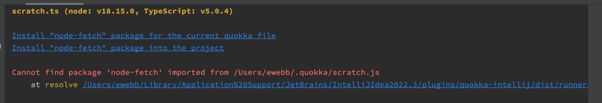

# quokka-support-yarn2-pnp

Example repo to debug ...

## Project Creation Steps

```bash
git init quokka-support-yarn2-pnp
cd quokka-support-yarn2-pnp
yarn init -2 
yarn add -D typescript ts-node @types/node

yarn install node-fetch
```

1. Run Quokka on `scratch.ts`

EXPECTED

* Package `node-fetch` to be founbd
* Fetch `https://postman-echo.com/get`

ACTUAL



NOTES

* I can install the package for the current file and it will work for the session. 
* Installing for the project does nothing.
